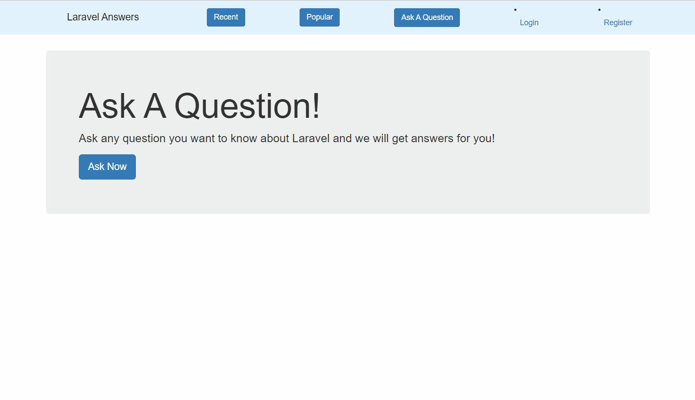
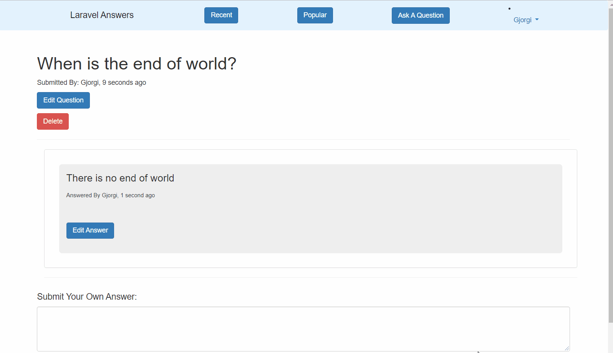

#  Questions & Answers



## About
 Laravel Questions site built using Laravel Framework 5.7 

Registered users can submit questions, answer questions, edit questions & delete questions. Verry simple app.


## Tech
* Laravel: https://github.com/laravel/laravel
* Twitter Bootstrap: http://getbootstrap.com

## Install
* Clone Project ```git clone linktogithubrepo.com/ projectName```
* cd into your project ```cd project name```
* Run Composer Install `composer install`
* Install NPM Dependencies ```npm install```
* Create a copy of your .env file  ``` cp .env.example .env```
* Generate an app encryption key ```php artisan key:generate```
* Create an empty database for our application
* In the .env file, add database information to allow Laravel to connect to the database
* Migrate the database ```php artisan migrate```
    
